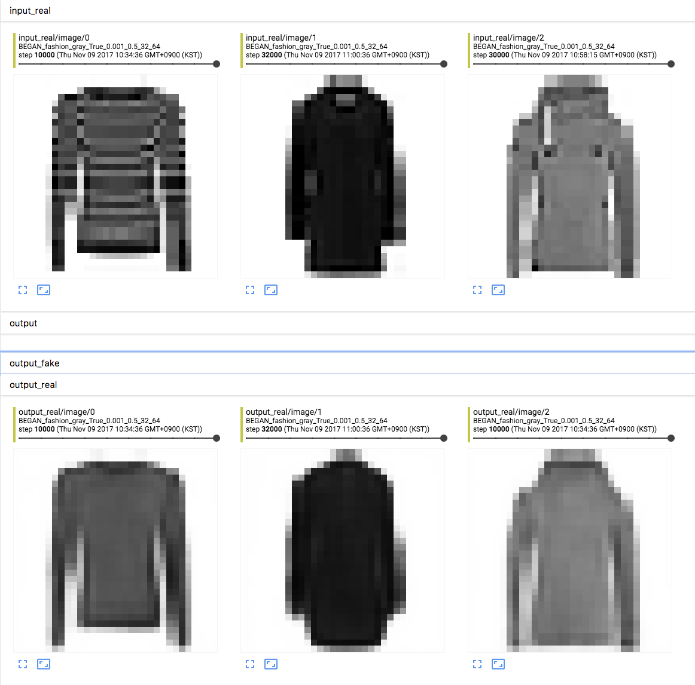

# BEGAN

BEGAN에서 residual추가 및 layer norm을 추가한 소스.

내 생각에는 CelebA가 전부 얼굴이라 mode collapse를 피할 수 있었다고 생각이 들었으며,

그래서 [fashion-mnist](https://github.com/zalandoresearch/fashion-mnist)를 가지고 실험했다.

짬짬히 만든거라 실험을 많이 해보지는 못하지만, 현재까지는 옷에 대해서만 generation을 하고있다.

# TODO
* decoder가 원래 구현보다 capacity가 조금 작은데, 이 때문에 edge들이 사라지는 것 같다.

* 위의 것이 되고나서 CelebA를 해봐야 제대로된 판단이 설 것 같다.

