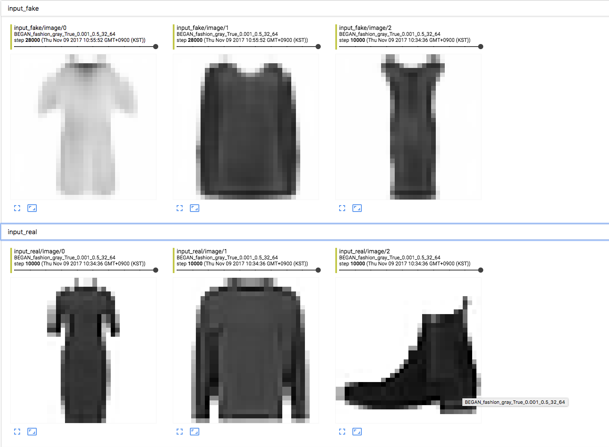
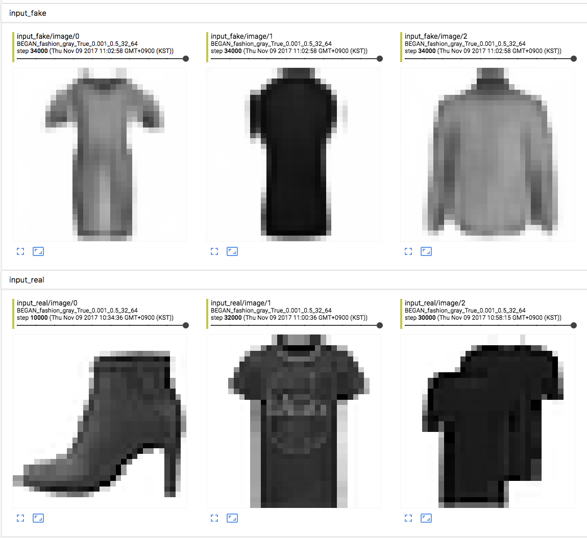
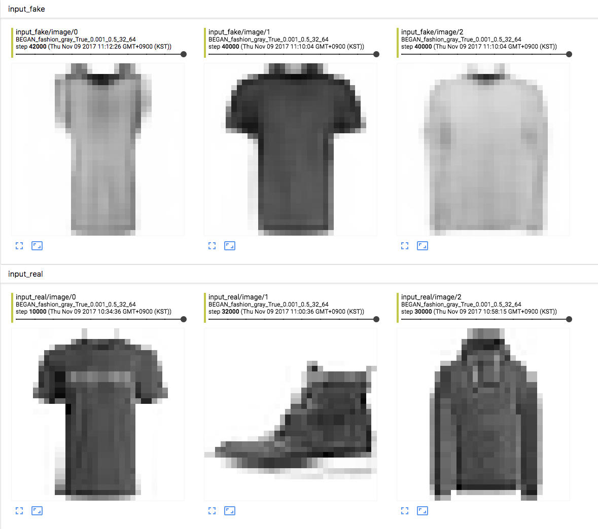
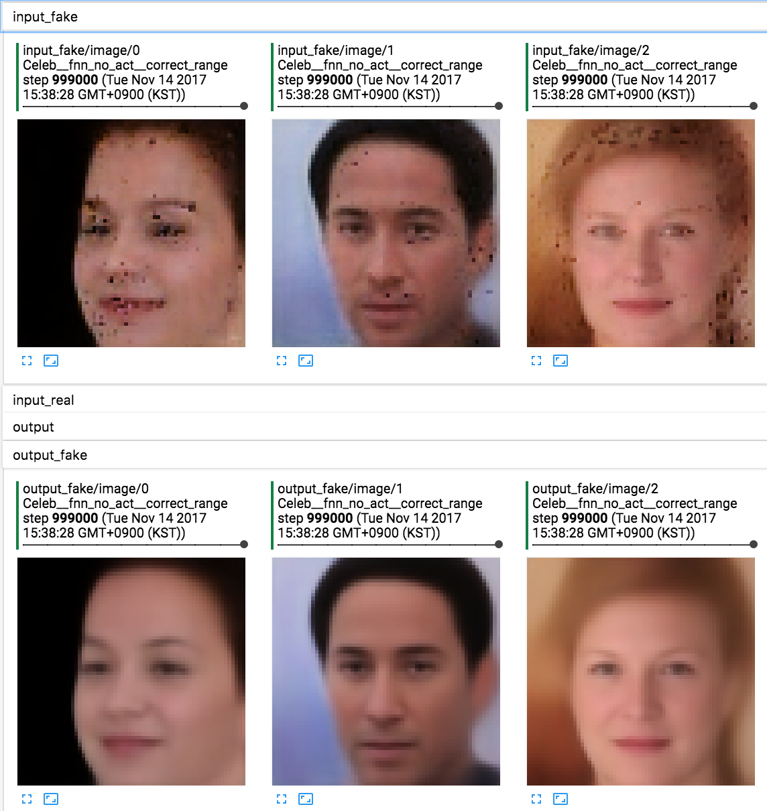
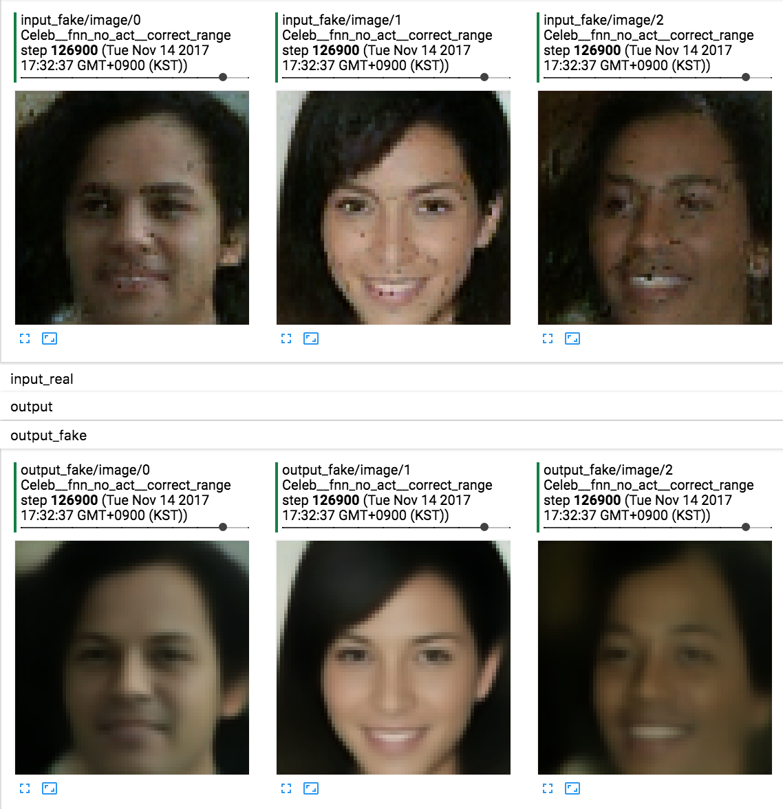
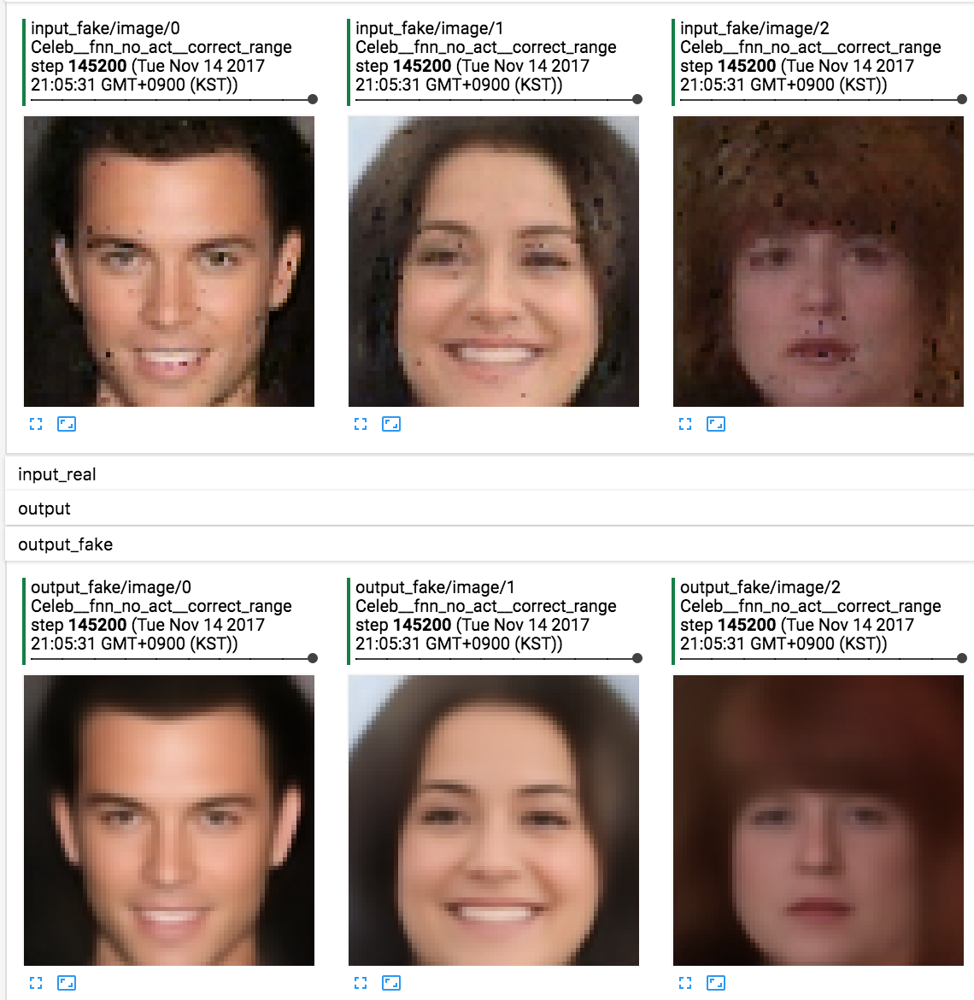
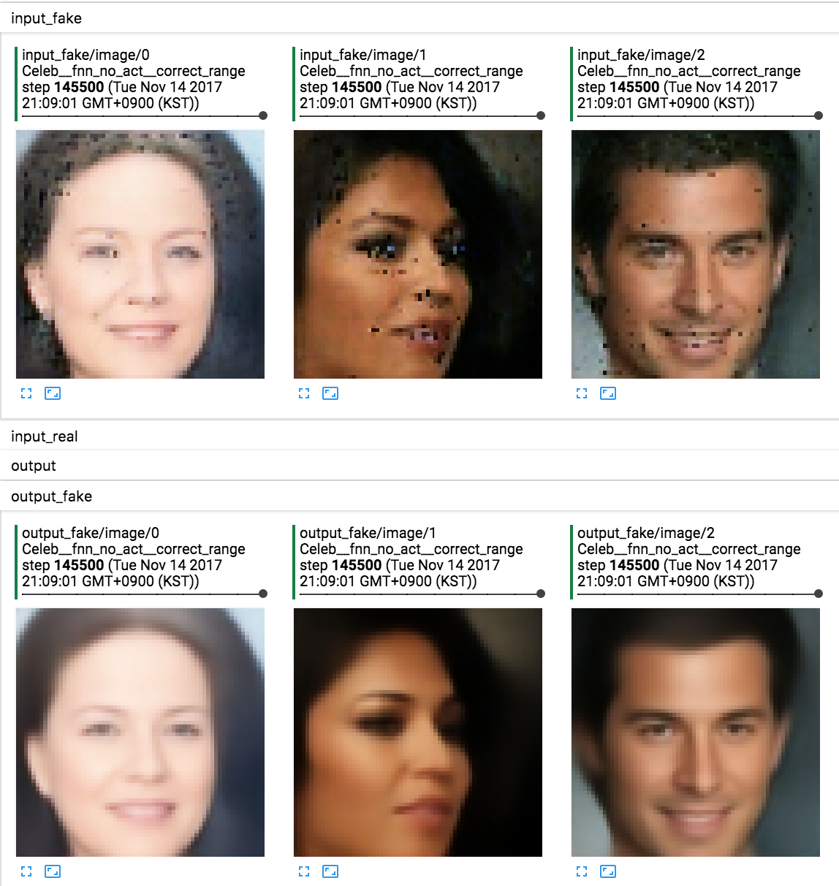

# BEGAN

BEGAN에서 residual추가 및 layer norm을 추가한 소스.

내 생각에는 CelebA가 전부 얼굴이라 mode collapse를 피할 수 있었다고 생각이 들었으며,

그래서 [fashion-mnist](https://github.com/zalandoresearch/fashion-mnist)를 가지고 실험했다.

짬짬히 만든거라 실험을 많이 해보지는 못하지만, 현재까지는 옷에 대해서만 generation을 하고있다.

> input fake가 generator가 만든 이미지, input real이 실제 이미지이다.

# 가설 검증 결과

CelebA 데이터는 모든 데이터가 그래도 비슷한 공간에 smooth하게 퍼져있기 때문에 mode collapse를 피할 수 있다고 생각이 들었고 이를 [CelebA로 실험](https://gist.github.com/Hulk89/77f23f1f4eea20b9f476976f4c6b0009)으로 검증했다.

위 링크로 나온 결과를 여기에 첨부한다.

위의 이미지가 generator의 결과이며, 아래 이미지가 AE를 통과한 결과이다.

